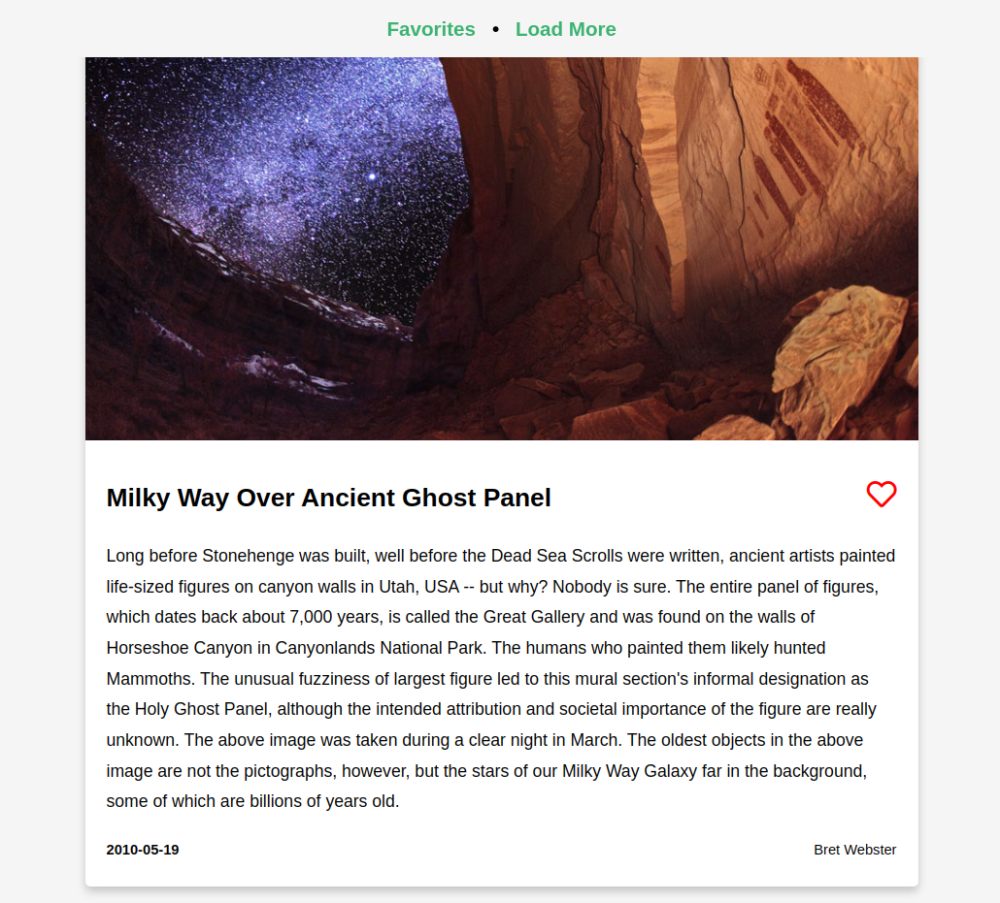

# react_NASA APOD: [LIVE DEMO](https://shcoobz.github.io/react_nasa-apod/)

## Summary

react_Nasa Apod provides an engaging web application that utilizes the NASA Astronomy Picture of the Day (APOD) API. It features a user-friendly interface that allows users to view breathtaking images and videos from space, manage their favorite astronomical phenomena, and explore details about each media piece.

The core functionality includes:

- Displaying the latest images and videos from NASA's APOD API.
- Favoriting system to save and manage preferred images and videos.
- Dynamic loading of new content without page refresh.

## Features

### Dynamic Content Loading

The application dynamically loads new images and videos from the NASA APOD API, ensuring users have access to the latest content without manual refreshing.

### Favorites Management

Users can easily add or remove items from their favorites, which are saved locally. This feature allows users to keep track of their preferred astronomical events and view them anytime.

### Responsive Design

The application is fully responsive, providing a seamless experience across all devices. It ensures that users can enjoy the content whether they are on a desktop, tablet, or mobile phone.

### Additional Features

- Error handling to manage and display messages when the API is unreachable or returns an error.
- Smooth animations and transitions for a visually appealing user interface.

## Technologies

- React: Utilized for building the user interface with components.
- FontAwesome: Provides icons used across the application for a clean and modern look.
- LocalStorage: Used for storing users' favorite items persistently.
- CSS: Custom styles for responsive design and animations.

---

_Note: This document provides an overview of react_NASA APOD. For detailed instructions and more information, please refer to the source code documentation._

_This project is a conversion from an earlier version built with vanilla JavaScript and HTML, available [here](https://github.com/Shcoobz/basicJS_nasa-apod/). This conversion integrates React to enhance UI reactivity and maintainability._
